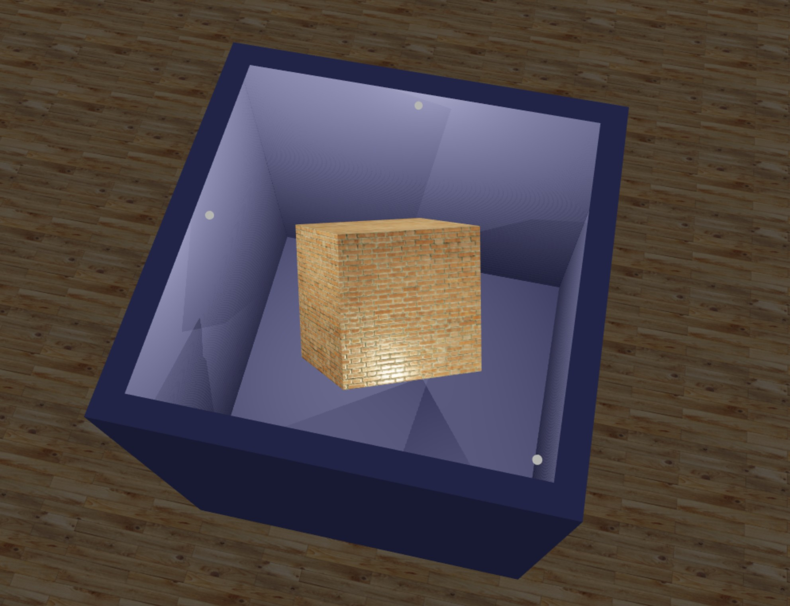

# Chapt 5
## Practices
### 1.  
$T$ = Translate window to the origin.
$$
T = \left[ 
\begin{matrix}
    1 & 0 & 0 \\
    0 & 1 & 0 \\
    -XW_{min} & -YW_{min} & 1 
\end{matrix}
\right] 
$$

$S$ = Scaling of the window to viewport size.
$$
S = \left[ 
\begin{matrix}
    S_x & 0 & 0 \\
    0 & S_y & 0 \\
    0 & 0 & 1
\end{matrix}
\right] 
$$

$T_1$ = Translating viewport on screen.
$$
T_1 = \left[ 
\begin{matrix}
    1 & 0 & 0 \\
    0 & 1 & 0 \\
    XV_{min} & YV_{min} & 1 
\end{matrix}
\right] 
$$

VT = Viewing Transformation.

$$ VT = T \times S \times T_1 $$

When $S_x \neq S_y$, objected will be stretched or contracted in either x or y direction. To make relative proportions maintained, we can simply replace $S$ with $S'$:

$$
S' = \left[ 
\begin{matrix}
    min(S_x, S_y) & 0 & 0 \\
    0 & min(S_x, S_y) & 0 \\
    0 & 0 & 1
\end{matrix}
\right] 
$$

Now we have new $VT' = T \times S' \times T_1$.

### 2.
* [Rotating Cube](rotating_cube.html)

> 
